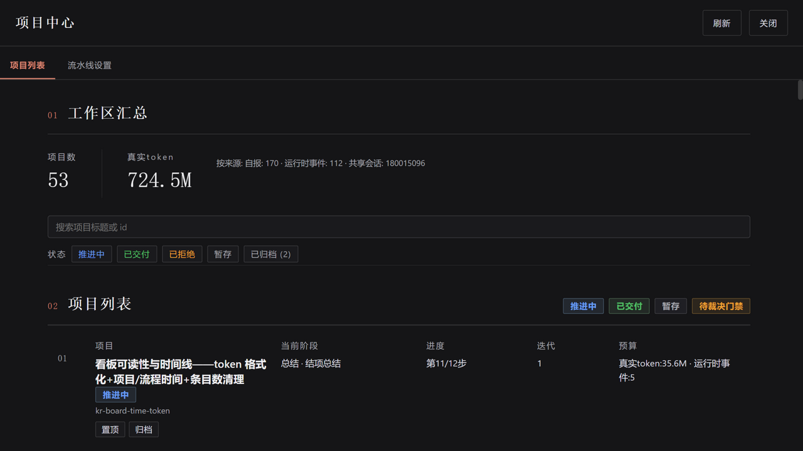
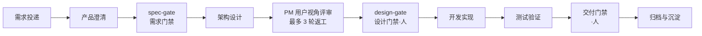

# dsh 项目制交付流水线

**让 AI 角色按流程交付项目、人类只在关键节点拍板。**

这是一套运行在 [DeepSeek Harness(dsh)](https://github.com/deepseek-ai) 上的项目制交付系统:你把需求投递给流水线,由 7 种 AI 角色(产品/架构师/开发/测试/交付/协调者/**产品经理**)按 12 阶段流程协作完成,人类只在三道门禁与最终验收时出场。全程留痕:每道门禁的批准都有出处,每枚 token 都记在账上。

| 组件 | 是什么 | 版本 |
|---|---|---|
| [`presets/project-pipeline`](presets/project-pipeline/) | **agent preset**——角色、12 阶段流程、门禁与审计规则 | v0.23.0 |
| [`host-plugins/project-hub`](host-plugins/project-hub/) | **宿主插件**——「项目中心」看板与流水线设置(网页界面) | v0.4.0 |
| [`toolkit/`](toolkit/) | **驱动工具链**——登记、裁决下发、值守监控 | — |



## 工作方式



- **三道门禁,人说了算**:需求、设计、交付三道门禁只能由人批准;AI 角色的每次 approve 都必须携带人类给出的裁决指针(`rulingRef`),没有指针的批准会被**机械拒绝**——AI 无权自行放行。
- **产品经理先审一轮**:架构师的设计稿先交"产品经理"角色从**用户视角**(可用性/易用性/场景/可读性)评审,最多 3 轮返工,通过后才到人面前——人只需终审一次。
- **真实验收不做假**:视觉观感、真实会话、部署重启类验收,流程上强制路由给人确认;AI 不得用静态检查冒充通过。
- **全程可审计**:每次自省审计留下带 SHA-256 的执行凭证;每个阶段的真实 token 消耗与耗时记录在案。

## 核心特性

- **12 阶段标准流程**(另有轻量修复流与批量沉淀流):需求澄清、双门禁、开发、测试、验收、归档、经验沉淀,全部数据驱动、可定制
- **项目中心看板**:项目列表与详情、流程进度(每阶段耗时与 token 消耗)、预算账本(真实 token 计量,逗号分组 + M/B 缩写)、流水线设置(策略/每角色模型分配),深浅色主题自适应
- **门禁与角色可插拔**:7 种角色各带工具白名单与行为边界;流程模板、沉淀策略、审计规则均为数据文件
- **工具无关驱动**:值守监控(registry 轮询 + WebSocket 帧通道)、裁决下发、会话收集均有命令行工具与协议文档,可接入 Claude Code / Codex / OpenCode / dsh headless 等任意驱动方

<details>
<summary>更多机制(点开)</summary>

- **验收路由前置化**:视觉观感/真实会话/部署重启类验收在需求阶段就声明为"用户侧确认",AI 不得以静态检查替代
- **审计执行凭证**:每次审计运行写入带哈希的凭证,可回放,杜绝"自称做过"
- **交付检查单**:版本号、更新日志、验收路由缺失时机械拦截,不进交付门禁
- **单环境默认,双环境可选**:默认一套 dsh 实例零配置;维护者可用配置文件显式开启 test/prod 双实例隔离

</details>

## 从 GitHub 部署到本地

前提:一个**已安装、可运行**的 dsh 实例(下文以默认地址 `http://127.0.0.1:3080` 为例)。

```bash
# 1. 克隆本仓库
git clone https://github.com/Karmel5950/dsh-preset-project-pipeline.git
cd dsh-preset-project-pipeline

# 2. 安装 preset(复制到 dsh 预设根,零依赖)
mkdir -p ~/.dsh/.agent-presets
cp -r presets/project-pipeline ~/.dsh/.agent-presets/project-pipeline
# Windows(cmd):xcopy /E /I .\presets\project-pipeline %USERPROFILE%\.dsh\.agent-presets\project-pipeline

# 3.(可选)安装项目中心看板宿主插件
cd host-plugins/project-hub && node deploy.mjs && cd ../..

# 4. 重启你的 dsh 实例

# 5. 验证
node presets/project-pipeline/scripts/pm-probe.mjs        # 静态要素
curl http://127.0.0.1:3080/plugins/project-hub/api        # 看板 API(装了第 3 步后)
```

> 仓库根**没有** `package.json`、没有 npm 脚本——安装就是"把目录放进 dsh 预设根",不需要构建。更新与版本核对见 [`docs/UPDATE.md`](docs/UPDATE.md)。

## 用 AI 驱动流水线

对已运行的 dsh 实例,用 `toolkit/` 里的命令行工具登记需求、下发裁决、值守监控:

```bash
node toolkit/pipeline-start.mjs --prompt <登记投递.md> --base-url http://127.0.0.1:3080
node toolkit/pipeline-drive.mjs --session <会话id> --prompt <裁决书.md>
node toolkit/pipeline-watch.mjs --session <会话id> --ws-root <流水线工作区>
```

协议细节(事件语义、裁决格式、安全边界)见 [`toolkit/PIPELINE-DRIVE-PROTOCOL.md`](toolkit/PIPELINE-DRIVE-PROTOCOL.md);完整操作手册见 [`skills/dsh-pipeline/SKILL.md`](skills/dsh-pipeline/SKILL.md)。

## 测试

```bash
cd presets/project-pipeline && node --test test/    # 292 项
cd host-plugins/project-hub && node --test test/    # 170 项
```

## 文档

| 文档 | 内容 |
|---|---|
| [`docs/UPDATE.md`](docs/UPDATE.md) | 已部署实例的五步更新闭环 |
| [`toolkit/PIPELINE-DRIVE-PROTOCOL.md`](toolkit/PIPELINE-DRIVE-PROTOCOL.md) | 工具无关驱动协议(事件语义/裁决格式/安全边界) |
| [`skills/dsh-pipeline/SKILL.md`](skills/dsh-pipeline/SKILL.md) | 驱动方完整操作手册(门禁审查/帧应答/APPLY 仪式) |
| [`presets/project-pipeline/CHANGELOG.md`](presets/project-pipeline/CHANGELOG.md) · [`host-plugins/project-hub/CHANGELOG.md`](host-plugins/project-hub/CHANGELOG.md) | 两条独立版本线的变更史 |

## 设计原则

- **门禁否决权在人**:一切自动化评审(产品经理/工具面审计/自省审计)都是前置质量闸,不替代人的终审
- **流程是数据,不是代码**:阶段、角色、门禁要求全部数据驱动,定制即改清单
- **框架优先于定死流程**:沉淀基础设施与升级路径,不为单个场景写死分支
- **不做假验收**:能力达不到就显式上报,禁止用静态检查冒充真实验收
